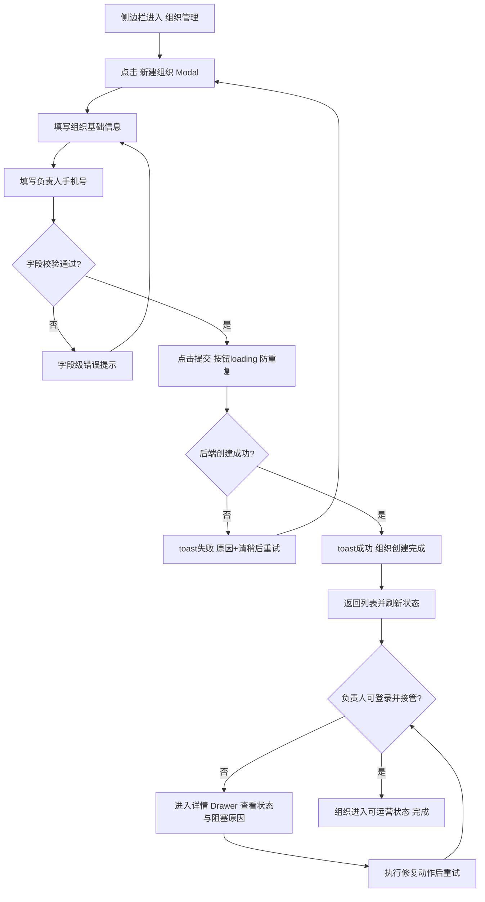
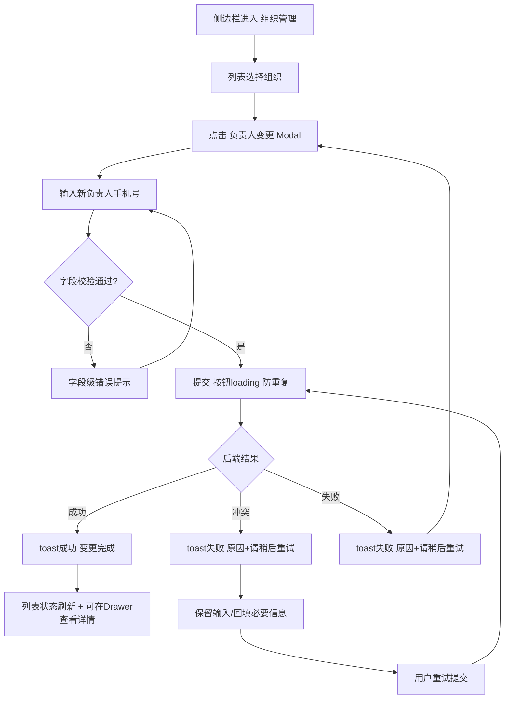
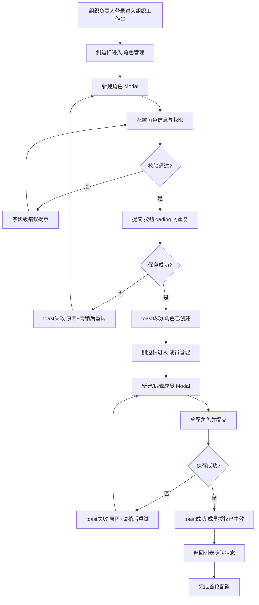

---
stepsCompleted:
  - 1
  - 2
  - 3
  - 4
  - 5
  - 6
  - 7
  - 8
  - 9
  - 10
  - 11
  - 12
  - 13
  - 14
lastStep: 14
workflowCompleted: true
inputDocuments:
  - '_bmad-output/planning-artifacts/prd.md'
  - '_bmad-output/planning-artifacts/prd-validation-report.md'
  - '_bmad-output/planning-artifacts/prd-appendix-legacy-inputs.md'
---

# UX Design Specification neweast

**Author:** 老大
**Date:** 2026-02-11 11:42:59 CST

---

<!-- UX design content will be appended sequentially through collaborative workflow steps -->

## Executive Summary

### Project Vision

neweast 的 UX 目标是把“高安全治理系统”变成“高确定性治理体验”。用户不仅要被保护，更要在每一步都清楚自己在哪个域、能做什么、做完是否生效。我们要把平台治理与组织治理做成边界清晰、反馈一致、可审计可恢复的操作系统级体验。

### Target Users

- 平台管理员：关注组织开通、负责人交接、平台治理动作的稳定闭环与可追踪性。
- 组织负责人/组织管理员：关注接管效率、授权生效确定性、异常时的恢复路径。
- 组织成员：关注权限内任务是否顺畅完成、权限外反馈是否清晰一致。
- 运维负责人：关注故障定位速度、责任链可追踪性与恢复操作可执行性。

### Key Design Challenges

- 双域入口与多组织切换会显著提高认知负担，用户容易误判当前域与可执行边界。
- 高风险治理流程（负责人变更、权限调整）需要同时满足安全、可理解、可回退。
- 权限系统跨前后端协同时，必须避免“可见但不可用”的体验断裂。
- 失败反馈若缺少可执行恢复动作，会放大重复操作与运营风险。

### Design Opportunities

- 建立“域上下文可见化 + 权限反馈一致化”体验基线，降低误操作与学习成本。
- 将关键治理流程产品化为“分步确认 + 结果回执 + 审计可追踪”的高信任交互。
- 为负责人首轮接管提供任务化引导，缩短从组织开通到组织可运营的时间。
- 将高频错误映射为可执行恢复建议，把故障体验从“报错”升级为“可恢复”。

## Core User Experience

### Defining Experience

neweast 的核心体验不是单一步骤，而是“配置 -> 生效 -> 可确认”的治理闭环体验。
对用户而言，价值不在于点了多少按钮，而在于关键配置动作能否一次完成、结果是否即时可信、后续是否可持续管理。

在当前阶段，核心成功路径聚焦在两条主线：
- 平台侧：组织配置完成并进入可运营状态。
- 组织侧：角色与人员配置完成并正确生效。

### Platform Strategy

- 当前主平台：Web（鼠标/键盘交互优先）。
- Web 端要求：支持系统通知，用于关键状态反馈与任务提醒。
- 后续扩展：移动端（触控交互）作为能力延伸，保持与 Web 一致的治理心智和反馈规则。
- 移动端同样需要系统通知能力。
- 当前无离线需求，优先保障在线状态下的一致性与可控性。

### Effortless Interactions

“顺畅”在本产品里意味着：
- 关键配置动作路径清晰，用户不需要反复猜“下一步做什么”。
- 操作反馈明确，用户能快速判断“是否已生效”。
- 跨页面、跨入口的规则一致，减少认知切换成本。
- 复杂治理动作被组织成可理解、可执行的连续流程，而不是碎片化操作。

### Critical Success Moments

以下是体验成败的关键时刻：
- 用户首次完成组织配置并确认组织进入可运营状态。
- 用户首次完成角色与人员配置，并看到权限结果与预期一致。
- 关键配置后能获得明确成功反馈（含状态/结果），形成“可控感”。

若这些时刻失败，用户会直接质疑系统可靠性与治理信任。

### Experience Principles

- 闭环优先：先保证“配置到生效”的完整通路，再优化局部交互效率。
- 一致优先：同一规则在不同入口与平台保持一致表达。
- 可确认优先：每次关键动作都要让用户明确知道结果与状态。
- 扩展优先：Web 先行，但从一开始就为移动端一致体验预留框架。

## Desired Emotional Response

### Primary Emotional Goals

neweast 的首要情绪目标是让用户始终保持掌控感。
不论是组织配置、角色配置还是人员配置，用户都应感到“我知道我在做什么、结果在我预期内”。

次级情绪目标是轻松与满意：流程不压迫、反馈不含糊，完成后有明确“做成了”的心理闭环。

### Emotional Journey Mapping

- 首次进入：轻松，不被复杂结构吓退。
- 执行核心配置动作时：信息清晰，步骤明确，掌控感持续增强。
- 完成关键任务后：满意，且对结果有确定感。
- 回访使用时：延续轻松与掌控，不需要重新学习。

### Micro-Emotions

本产品优先级最高的微情绪为：
- 信息清晰 > 困惑
- 掌控感 > 失控感
- 满意 > 无感

### Design Implications

- 掌控感 -> 关键流程必须可见当前状态、下一步动作、最终结果。
- 轻松 -> 降低步骤负担，减少不必要确认，界面信息层级清楚。
- 信息清晰 -> 反馈语义统一（成功、失败、冲突、恢复路径一致表达）。
- 满意 -> 关键完成时给出明确“完成确认”，而不是模糊提示。

### Emotional Design Principles

- 先让用户看懂，再让用户操作。
- 每个关键动作都必须“可确认、可解释、可追踪”。
- 错误信息必须指向可执行下一步，避免情绪坠落。
- 体验一致性优先于局部炫技，稳定地建立信任。

## UX Pattern Analysis & Inspiration

### Inspiring Products Analysis

当前明确的参考来源是 Ant Design 生态（含示例页面），但 neweast 的策略不是复刻模板，而是在强约束下构建“短路径、就地操作、反馈一致”的治理体验。

关键方向：
- 菜单作为主要定位来源，不依赖面包屑与页面标题。
- 页面路径尽量短，减少页面跳转。
- Web 端详情统一 Drawer，保持任务上下文连续。
- 新建/编辑/导入统一 Modal，就地完成关键操作。

### Transferable UX Patterns

- 信息架构模式：
  - 以菜单定位为主，聚焦任务入口与最短操作链路。
  - 列表页作为治理工作台，操作后回到同一上下文。

- 交互容器模式：
  - 新建/编辑/导入：AntD Modal
  - 详情查看（Web）：AntD Drawer（统一使用 `size`，不自定义 `width` 数值）
  - 详情查看（移动端）：单独详情页面

- 反馈与提交模式：
  - 反馈提示统一走 toast 组件入口。
  - 表单校验错误使用字段级提示，不与 toast 重复叠加。
  - 所有提交按钮必须 loading，并防重复提交。

- 组件与生态模式：
  - UI 基于 Ant Design 6+
  - 仅允许 AntD 原生组件与已有的 AntD 基础封装组件
  - 禁止使用 Ant Design Pro 组件
  - 禁止从 0 到 1 编写脱离 AntD 的独立组件
  - 图标统一 `@ant-design/icons`
  - 日期统一 `dayjs`（展示样式统一 `yyyy-mm-dd hh:mm`，实现按 dayjs 正确 token）
  - 图表统一 ECharts

### Anti-Patterns to Avoid

- 为了“页面完整”引入深路由与长路径，增加治理操作负担。
- 在 Web 详情场景引入单独详情页，打断列表上下文。
- 各页面自行定义 Drawer 宽度与交互规则，导致体验漂移。
- 混用多种反馈通道，造成信息噪音与认知冲突。
- 允许组件体系失控（Pro 组件、脱离 AntD 自研组件）导致维护成本失衡。

### Design Inspiration Strategy

- What to Adopt:
  - Adopt：AntD 6+ 的一致交互体系与成熟后台范式。
  - Adopt：列表工作台 + 弹层完成任务的高效率治理节奏。

- What to Adapt:
  - Adapt：将通用后台模式改造为“双域治理”最短路径体验。
  - Adapt：将反馈统一收敛到 toast 入口，并与字段级错误分层。

- What to Enforce:
  - Enforce：UX 规范遵循 Ant Design 设计规范。
  - Enforce：本地化优先使用 AntD 配置项（按实际本地化结果展示，不做强中英文校验）。
  - Enforce：提交行为统一 loading + 防重复提交（前后端协同保障）。

- What to Avoid:
  - Avoid：不必要的 CSS 扩展与新增 CSS 文件（仅在确实不满足时最小补充）。
  - Avoid：与统一组件策略、统一反馈策略冲突的页面级“特例实现”。

## Design System Foundation

### 1.1 Design System Choice

采用 Established System 路线，设计系统基础统一为 Ant Design 6+。
不采用自建设计系统，不采用 Ant Design Pro 组件体系，不引入平行 UI 组件体系。

### Rationale for Selection

- 交付效率优先：AntD 组件成熟，适配后台治理场景，能快速落地“短路径 + 就地操作”。
- 一致性优先：统一组件语义和交互模式，支撑“掌控感、轻松、信息清晰、满意”的体验目标。
- 维护成本可控：限制组件来源，避免多套组件并存带来的样式漂移与维护负担。
- 现有约束匹配：与你已定义的 Modal/Drawer/toast/loading 防重策略天然兼容。

### Implementation Approach

- 框架基线：统一使用 Ant Design 6+。
- 组件来源：仅允许 AntD 原生组件 + 现有基于 AntD 的封装组件。
- 禁止项：
  - 禁止使用 Ant Design Pro 组件
  - 禁止从 0 到 1 编写脱离 AntD 的独立组件
- 交互容器：
  - 新建/编辑/导入：Modal
  - Web 端详情：Drawer（统一使用 `size` 属性）
  - 移动端详情：单独页面
- 反馈与提交：
  - 反馈统一走 toast 组件入口
  - 表单校验错误使用字段级提示，不与 toast 重复叠加
  - 所有提交按钮必须 loading，并防重复提交
- 本地化与时间：
  - 本地化使用 AntD 全局配置项（按实际本地化结果展示）
  - 日期处理统一 dayjs，展示样式统一 `yyyy-mm-dd hh:mm`（实现层按 dayjs 正确 token）

### Customization Strategy

- 以 AntD 官方设计规范为主，优先通过组件属性、Token 和规范化封装实现差异化。
- 默认不新增额外 CSS 文件；仅在确实无法满足时做最小必要补充。
- 定制重点放在业务模式与流程编排（治理路径、反馈一致性、操作防误触），而非重造视觉基础组件。
- 所有定制必须保持“可复用、可测试、可回归”，禁止页面级临时特例扩散。

## 2. Core User Experience

### 2.1 Defining Experience

neweast 的定义性交互是：在统一治理工作台中，以简洁、高效的方式完成组织、角色、人员等关键配置，并快速确认结果是否生效。
用户无需在复杂页面间跳转，核心任务通过成熟后台模式（菜单导航 + 列表工作台 + Modal/Drawer）完成，确保流程可理解、可执行、可回到上下文继续工作。

### 2.2 User Mental Model

用户对当前同类系统的心智是“操作复杂、步骤多、常常不知道下一步干什么”。
因此用户期待的不是更花哨的交互，而是：
- 明确的任务入口
- 清晰的操作路径
- 每一步之后都知道系统状态与后续动作

neweast 采用成熟交互模式（A 路线），降低学习成本，优先建立“这系统我一看就会、一次就能做完”的心智。

### 2.3 Success Criteria

核心体验成功的关键指标：

- 关键配置可在同一上下文内完成，减少不必要页面跳转。
- 用户提交后可快速获得明确结果反馈（成功/失败/冲突）。
- 用户首次完成组织 + 角色 + 人员配置时感知流程顺畅、效率高。

### 2.4 Novel UX Patterns

本产品不依赖全新交互范式，采用成熟后台模式为主：

- Established Patterns:
  - 菜单驱动导航
  - 列表工作台 + 弹层操作
  - 统一反馈语义
- Innovation Focus:
  - 在成熟模式下优化路径长度与反馈清晰度
  - 强化“简洁、高效”的执行感，而非引入额外学习负担

### 2.5 Experience Mechanics

1. Initiation
- 用户从菜单进入目标治理模块，快速定位任务入口。

2. Interaction
- 用户在列表页发起操作，使用 Modal/Drawer 完成新建、编辑、导入与详情查看。

3. Feedback
- 字段错误采用就地提示；全局操作结果统一通过 toast 提示，确保反馈一致且可立即感知。

4. Completion
- 用户完成操作后关闭弹层返回原列表，上下文保持不丢失，并看到更新后的状态结果，继续下一任务。

## Visual Design Foundation

### Color System

- 主题色策略：直接使用 Ant Design 默认主题色体系，不单独定义品牌色板。
- 语义色策略：沿用 AntD 语义色（主色、成功、警告、错误、信息）及其默认状态层级。
- 应用原则：
  - 用语义色表达状态，不用装饰色堆砌视觉层次。
  - 颜色优先服务可读性与状态识别一致性。
  - 不额外扩展色阶，除非明确业务场景无法覆盖。

### Typography System

- 视觉语气：现代简洁，信息表达直接，不做冗余装饰。
- 可读性策略：信息不松散，保持中等密度下的稳定阅读节奏。
- 字体与层级：采用 AntD 默认排版体系与层级规范（标题、正文、说明文本）。
- 文本策略：
  - 关键状态与操作文案优先清晰可理解。
  - 避免长句与模糊提示，减少认知负担。

### Spacing & Layout Foundation

- 基础节奏：采用 AntD 推荐的 `8px` 作为主间距节奏。
- 微调策略：在组件内部细节场景可使用更小粒度做局部调节，但不破坏 8px 主节奏。
- 页面密度：整体采用“适中平衡”，兼顾信息承载与扫描效率。
- 布局原则：
  - 保持列表工作台结构稳定，减少视觉跳变。
  - 弹层（Modal/Drawer）内外间距一致，确保跨页面体验统一。

### Accessibility Considerations

- 统一遵循 Ant Design 设计规范中的可访问性要求与交互规范。
- 可访问性执行口径基于 AntD 组件与配置能力，不做额外独立规范分叉。
- 视觉与交互优先复用 AntD 原生能力，确保一致性与可维护性。

## Design Direction Decision

### Design Directions Explored

本阶段共探索 8 个方向，均基于已确认约束：
- Ant Design 6+ 组件体系
- Web 端详情统一 Drawer（使用 size 属性）
- 新建/编辑/导入统一 Modal
- 反馈统一 toast 组件入口
- 8px 基础节奏与适中平衡密度

方向差异主要体现在信息层次、状态表达强度、流程引导方式与列表工作台权重。

### Chosen Direction

最终选择：**方向 1｜平衡治理工作台**

该方向以列表工作台为中心，菜单定位清晰，状态反馈直观，整体交互节奏稳定，最贴合“简洁 + 高效”的核心目标。

### Design Rationale

- 兼顾信息承载与可读性，不会过于拥挤或过于松散。
- 关键操作入口明确，减少“下一步做什么”的认知成本。
- 反馈与状态表达清晰，能快速确认操作结果是否生效。
- 实现复杂度可控，适合当前团队以稳定节奏快速落地。

### Implementation Approach

- 以方向 1 作为全局基线模板，优先覆盖组织、角色、成员三条核心治理主线。
- 保持“列表工作台 + Modal/Drawer + toast”统一交互骨架，不引入页面级特例。
- 在保留方向 1 主结构前提下，可按模块吸收其它方向中的局部优势（如状态可视、步骤化引导），但不得破坏统一规范。

## User Journey Flows

### 平台管理员-组织治理（创建组织到可运营）

目标：让平台管理员以最短路径完成组织开通，并确认组织进入可运营状态。

### 平台管理员-负责人变更（冲突可恢复）

目标：在高风险场景下保持事务一致、冲突可识别、重试可执行。

### 组织负责人-角色与成员配置（首轮接管）

目标：负责人首次进入后顺畅完成角色与成员配置，快速形成可用权限模型。

### Journey Patterns

- 导航模式：
  - 导航框架固定为现有侧边栏组件。
  - 列表页作为模块主页面，不做不必要跳转。
- 操作模式：
  - 新建/编辑/导入统一 Modal。
  - 详情查看统一 Drawer，不跳转 Web 详情页。
  - 页面内容组件优先使用现有已创建组件。
  - 现有组件不满足时使用 AntD 原生组件，不从 0 到 1 新写独立组件。
- 反馈模式：
  - 字段问题走字段级错误提示。
  - 全局结果统一 toast（失败统一“原因 + 请稍后重试”）。
- 恢复模式：
  - 冲突与失败后保留必要上下文，支持直接重试。
  - 关键状态变更后列表刷新并可在 Drawer 查看细节。

### Flow Optimization Principles

- 最短路径优先：减少跨页跳转与重复输入。
- 一致反馈优先：用户每一步都知道当前结果与下一步动作。
- 上下文连续优先：操作完成后回到原列表位置继续任务。
- 高风险可恢复优先：冲突场景必须有可执行重试路径。

### Journey 6（MVP）Non-UI 执行模式

- 范围声明：`MVP 不提供任何运维前端页面`。
- 执行边界：Journey 6 通过外部可观测平台与 Runbook 完成，不在产品前端内承载操作台。

MVP 运维闭环步骤：
1. 告警触发（鉴权失败率/越权拒绝率/负责人变更失败率）。
2. 通过 `request_id`/`traceparent` 在日志与审计中定位影响范围。
3. 核对发布门禁/能力分组结果，确认是否为已知变更引入。
4. 执行恢复动作（重试/回滚/升级），并记录处理结果。
5. 归档处置记录并确认恢复状态。

最小可观测字段契约：
- `request_id`
- `traceparent`
- `error_code`
- `retryable`
- `affected_scope`
- `affected_org_id`
- `runbook_link`

一致性要求：
- 即使无产品前端页面，Journey 6 仍需具备“可触发、可定位、可处置、可留痕”的完整执行闭环。

## Component Strategy

### Design System Components

基于 Ant Design 6+ 与现有组件库，当前可直接使用：

- 布局与导航：
  - `CustomLayout`（侧边栏导航主框架）
  - `CustomPage`（页面容器，默认不启用 breadcrumb）
- 筛选与表单：
  - `CustomFilter`
  - `CustomForm`
- 容器与内容承载：
  - `CustomCard`
  - `CustomPanel`
- 列表与表格：
  - `CustomCardTable`
  - `CustomPanelTable`
- AntD 原生组件（按需）：
  - `Modal`（含 Steps）
  - `Drawer`（详情容器，仅使用 size 属性）
  - `message`（统一反馈提示）
  - `Form`、`Table`、`Button`、`Tabs`、`Select`、`ConfigProvider`

覆盖判断：
- 现有组件已覆盖页面骨架与主要列表场景。
- 不新增额外轻封装组件，直接使用 AntD 原生组件完成缺口场景。

### Custom Components

本项目阶段不新增额外自定义组件（含轻封装组件）。  
组件策略为：优先复用现有 `Custom*` 组件，缺口直接使用 AntD 原生组件。

### Component Implementation Strategy

- 复用优先级：
  1. 现有 `Custom*` 组件
  2. AntD 原生组件
- 约束：
  - 禁用 Ant Design Pro 组件
  - 禁止从 0 到 1 编写脱离 AntD 的独立组件
  - 不新增 CSS 文件，必要样式最小化
- 一致性规则：
  - 全局反馈统一使用 AntD `message`
  - 新建/编辑/导入统一使用 AntD `Modal`
  - Web 详情统一使用 AntD `Drawer`（使用 size，不自定义 width 数值）
  - 所有提交按钮统一 loading + 防重复提交
  - 页面内容优先使用现有组件，不足时使用 AntD 原生组件补齐

### Implementation Roadmap

**Phase 1 - 核心闭环能力**
- 在组织、角色、成员主流程中统一 `message/Modal/Drawer` 规则。
- 落实提交按钮 loading 与防重复提交。

**Phase 2 - 高风险流程一致性**
- 在负责人变更等高风险流程中统一失败语义（原因 + 请稍后重试）。
- 打通冲突重试路径与列表上下文保持。

**Phase 3 - 规范治理与回归**
- 建立页面级组件使用检查清单（是否符合现有组件优先 + 原生补齐规则）。
- 建立最小回归清单（反馈、弹层、提交防重、时间显示一致性）。

## UX Consistency Patterns

### Button Hierarchy

- 主按钮（Primary）：
  - 每个操作区最多 1 个主按钮（如“新建”“提交”）。
  - 关键提交动作统一使用主按钮。
- 次按钮（Default）：
  - 用于辅助动作（如“取消”“重置”“返回”）。
- 危险按钮（Danger）：
  - 仅用于不可逆或高风险动作，需二次确认。
- 提交行为统一：
  - 所有提交按钮点击后必须进入 loading。
  - loading 期间禁止重复点击与重复提交。
  - 回车触发提交时同样遵循防重复逻辑。
- 文案规则：
  - 按钮文案优先简短中文动词（如“新建”“保存”“取消”）。

### Feedback Patterns

- 全局反馈统一：
  - 统一使用 AntD `message`。
- 字段错误反馈：
  - 表单校验失败使用字段级错误提示，不与全局 `message` 重复叠加。
- 失败语义统一：
  - 失败提示使用“原因 + 请稍后重试”结构。
- 成功反馈统一：
  - 成功后提示简洁明确，并与后续状态刷新联动。
- 冲突反馈：
  - 冲突场景需明确可重试，不使用模糊失败语义。

### Form Patterns

- 容器一致性：
  - 新建/编辑/导入统一在 `Modal` 中完成。
  - 多步骤流程使用 `Modal + Steps`。
- 校验一致性：
  - 前端字段即时校验 + 提交前最终校验。
  - 错误信息定位到字段本身，便于快速修正。
- 提交流程：
  - 提交 -> loading -> 成功/失败反馈 -> 返回原上下文。
- 内容复用：
  - 表单优先复用 `CustomForm` 与现有字段组件。
  - 现有组件不足时使用 AntD 原生表单组件补齐。

### Navigation Patterns

- 全局导航：
  - 统一使用现有侧边栏组件，不新增导航体系。
- 页面主结构：
  - 列表页作为模块主页面（组织/角色/成员等）。
- 详情模式：
  - Web 详情统一使用 `Drawer`，不走 Web 单独详情页。
  - `Drawer` 统一使用 `size` 属性，不自定义 width 数值。
- 上下文保持：
  - 关闭 Modal/Drawer 后回到原列表上下文（筛选/分页/位置保留）。
- 移动端差异：
  - 移动端详情使用单独页面（与 Web 区分）。

### Additional Patterns

- Empty/Loading：
  - 空状态、加载状态统一使用 AntD 规范化表现，不做页面自定义风格分叉。
- Search/Filter：
  - 查询与筛选入口位置固定、文案统一、重置行为一致。
- Table：
  - 列表优先复用 `CustomCardTable` / `CustomPanelTable`。
  - 分页文案与行为保持一致。
- Localization：
  - 本地化统一通过 AntD 配置项生效；显示以配置结果为准，不做强制文案语言校验。
- Time Display：
  - 时间展示样式统一 `yyyy-mm-dd hh:mm`（实现层按 dayjs 正确 token）。

## Responsive Design & Accessibility

### Responsive Strategy

- 采用 Desktop-first 策略，优先保障 Web 主流程体验完整与稳定。
- 平板与移动端采用能力收敛策略，优先保证关键任务可达与可执行。
- 详情策略分端执行：
  - Web：统一使用 Drawer
  - 移动端：使用单独详情页面
- 布局与交互遵循既定规则：侧边栏导航 + 列表主页面 + Modal/Drawer 操作闭环。

### Breakpoint Strategy

- 采用 AntD 默认断点体系，不单独定义自定义断点标准。
- 设计与开发口径：
  - Mobile：`<768px`
  - Tablet：`768px - 1023px`
  - Desktop：`>=1024px`
- 各断点以“信息可读 + 操作可达 + 路径不变形”为优先目标。

### Accessibility Strategy

- 可访问性统一遵循 Ant Design 设计规范与组件能力。
- 执行基线采用 WCAG AA 目标（以工程可落地为原则）。
- 关键关注点：
  - 焦点可见
  - 键盘可达
  - 语义化反馈一致
  - 文本与状态信息可辨识

### Testing Strategy

- **真实浏览器测试（Chrome）为发布前强约束，必须通过后方可进入发布流程。**
- 浏览器测试范围仅覆盖 Chrome。
- 自动化测试可使用 Playwright，目标浏览器为 Chrome。
- 覆盖关键链路：登录、组织配置、角色配置、成员配置、负责人变更。
- 覆盖关键交互：Modal、Drawer、message、提交 loading + 防重复。
- 响应式验证通过 Chrome 视口仿真完成（mobile/tablet/desktop）。
- 人工验证包含：键盘导航、焦点流、弹层交互与关闭行为。

### Implementation Guidelines

- 组件优先级：现有组件优先，缺口使用 AntD 原生组件补齐。
- 不新增 CSS 文件，必要样式调整最小化。
- 本地化统一依赖 AntD 配置项。
- 时间展示样式统一 `yyyy-mm-dd hh:mm`（实现按 dayjs 正确 token）。
- 响应式与可访问性策略纳入发布前回归检查清单。
